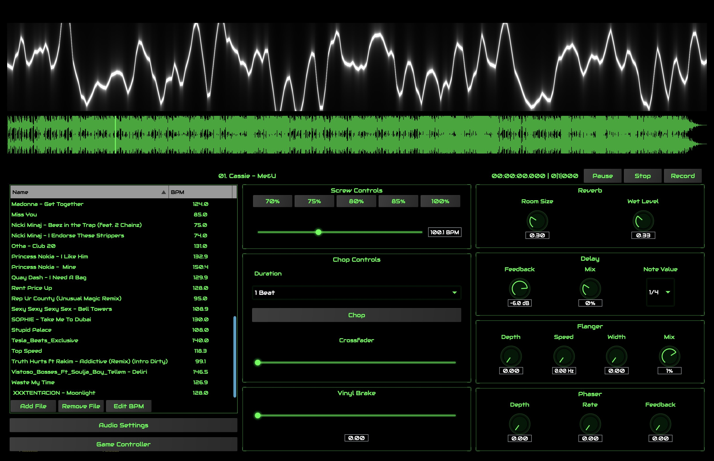

# ChopShop

ChopShop is a cross-platform Chopped & Screwed workstation built with JUCE framework that allows you to play chopped & screwed live and create edits.

## Features

- Real-time audio processing
- Cross-platform compatibility (Windows, macOS, Linux, iOS, Android)
- Low-latency audio engine
- Modern GUI interface
- Support for multiple audio formats

## Development

This project uses:
- JUCE for audio processing and GUI
- Tracktion Engine for transport management
- Modern C++ (C++20)
- CMake build system